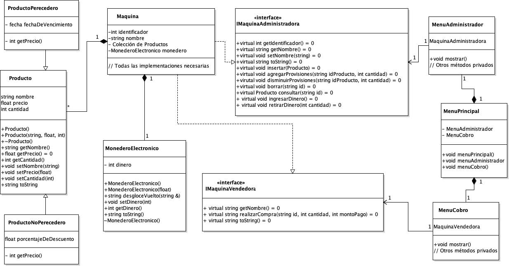

# PROYECTO 1

| UNIVERSIDAD NACIONAL                       | ESCUELA DE INFORMÁTICA                          |
| ------------------------------------------ | ----------------------------------------------- |
| EIF 204 PROGRAMACIÓN 2                     | EJERCICIO DE CÁTEDRA N° 1                       |
| FECHA DE ENTREGA AL ESTUDIANTE:            | SEMANA 4 (17 de agosto al 23 de agosto)         |
| FECHA DE ENTREGA PRIMER AVANCE AL DOCENTE: | SEMANA 9 (21 de setiembre al 27 de setiembre)   |
| PUNTAJE TOTAL:                             | 100 Puntos                                      |
| PORCENTAJE:                                | Corresponde a un 20% de la nota final del curso |

## CONDICIONES DEL PROYECTO

El Proyecto de Aprendizaje del curso EIF204 Programación 2 pretende que el estudiante ponga en práctica los siguientes temas:

- Principios de Diseño
- Jerarquías de Clases
- Relaciones entre Clases

Se presenta un problema que el estudiante debe implementar en el IDE seleccionado por el profesor para desarrollar un proyecto en C++, y posteriormente subirlo al aula virtual en la sección que el profesor habilite para esto. El ejercicio se trabaja en grupos. Cualquier plagio se calificará con 0, como lo establece el artículo 24 del Reglamento General sobre los procesos de Enseñanza y Aprendizaje de la Universidad Nacional.

## TEMAS EVALUADOS:

1. Mejores prácticas de programación
2. Herencia
3. Polimorfismo
4. Relaciones entre clases

## ENUNCIADO DEL PROBLEMA

La empresa La Máquina del Tiempo se encarga de vender máquinas expendedoras a las empresas productoras, para que estas puedan poner sus productos ya sea perecederos o no perecederos en las máquinas de autoservicio en lugares convenientes para los clientes y así poder incrementar las ventas.

Esto ha hecho que la empresa tenga la necesidad de crear un nuevo software para el manejo de las máquinas, el cual se debe adaptar sin importar el producto o las características de este para el cual se haya diseñado la máquina.

El cliente quiere además que la máquina esté equipada con un menú para administradores y un menú para el usuario:

- Opción de administración: esta es solamente accesible por el administrador de la máquina por lo que este menú en particular permite:
  - Trabajar directamente con los productos con funciones tales como: insertar, modificar, borrar información.
  - Trabajar con el dinero del monedero electrónico de la máquina: consultar el saldo, retirar dinero de la máquina.
- Opción de venta: esta opción del menú es ya para el público en general por lo que solamente permite realizar compras y devolver el vuelto.

## Clases

**Clase Producto (10 puntos)**

- Esta clase es una generalidad que agrupa cualquier tipo de producto con cualquier tipo de comportamiento, es por esto que en su estructura tiene métodos virtuales puros, que las clases derivadas deberán desarrollar.

**Clase ProductoNoPeredecero (5 puntos)**

- A los no perecederos: se les aplica un descuento previamente establecido.

**Clase ProductoPerecedero (5 puntos)**

- A los perecederos: se les aplica un 50% de descuento si falta menos de una semana para su fecha de vencimiento.

**Clase IMaquinaAdministradora (5 puntos)**

- Esta clase es una interfaz, la cual tendrá los métodos que permiten administrar como tal la máquina. Esta clase es una interfaz y todos sus métodos virtuales puros.

**Clase IMaquinaVendedora (5 puntos)**

- Esta clase es una interfaz, la cual tendrá los métodos que permiten al usuario realizar la compra. Esta clase es una interfaz y todos sus métodos virtuales puros.

**Clase Máquina (20 puntos)**

Esta clase se adapta con facilidad al escenario donde los productos cambian, considerando que su dependencia con la clase producto es una dependencia con una abstracción, por lo que le permite a esta clase adaptarse a cualquier tipo de especialización de la interfaz producto. Es importante notar que esta clase tiene herencia múltiple ya que debe implementar las dos interfaces IMaquinaAdministradora y IMaquinaVendedora.

**Clase MonederoElectrónico (10 puntos)**

El monedero electrónico se encarga de manejar el dinero de la máquina. Dentro de esta clase existe un método que se encarga de calcular el vuelto a ser entregado al usuario cuando este cancela (*string desgloceVuelto()*) este método debe seguir el algoritmo voraz (greedy algorithm) para devolver la menor cantidad de monedas cuando se calcula el vuelto. Este método devuelve en texto el detalle completo del desglose.

Los productos tienen precios cerrados con valores definidos entre 200, 300, 700. El cliente normalmente paga con billetes de 2000 o 5000. Por lo que la máquina debe calcular el desgloce en monedas de 100, monedas de 500, billetes de 1000 y billetes de 2000 cuál es la mejor forma de entregar el vuelto al cliente, este detalle es lo que debe devolver el método.

**Clase MenúPrincipal**

Esta clase tiene dos características de tipo MenuAdministrador y MenuCobro. Esta clase debe velar por la existencia de todos los menús de la aplicación, para mostrar adecuadamente al usuario y capturar las selecciones hechas por el usuario, así como de manejar su interacción correspondiente. Recuerde que el menú debe ser un ciclo sin fin hasta que le usuario decida salir. El comportamiento es similar para los sub menús de administrador y cobro.

**Clase MenuAdministrador (10 puntos)**

Este menú debe contar con las administraciones básicas de la máquina, tales como insertar, modificar, borrar información, ingresar dinero y retirar dinero.

**Clase MenuCobro (10 puntos)**

Las opciones del menú son:

1. Mostrar Producto: aquí se muestra en pantalla la lista de productos y su respectiva posición.
2. Seleccionar Producto: aquí el usuario selecciona la posición del producto escogido. Esta opción muestra la cantidad disponible y el precio del producto que el usuario desea. Y se le consulta al usuario si desea realizar la compra o cancelar:
   1. Realizar la compra: Si el cliente desea continuar con la compra, la máquina ingresa a un sub-menú que le indica que debe introducir el dinero, capturando vía pantalla el monto recibido. De nuevo el sistema consulta si desea continuar o cancelar. En el caso que haya continuado, el sistema recibe el dinero, corrobora que sea suficiente, si no es suficiente le informa al usuario el dinero faltante y se cancela la operación. Si el dinero es suficiente, se entrega el producto, lo que muestra en pantalla el nombre del producto vendido y el vuelto entregado, reduce el inventario del producto, y aumenta el dinero recolectado en la billetera de la máquina.
      1. Tome en cuenta que es justo en este paso donde la venta se concreta que el sistema debe informar al usuario del desglose de su vuelto. Recuerde que La clase Máquina está compuesta por un MonederoElectrónico que a su vez internamente tiene el método desgloceVuelto.
3. Salir

## Requerimientos adicionales de diseño

El arquitecto de software a cargo del proyecto le ha pedido además que cumpla con los siguientes principios de diseño:

- Responsabilidad Única: **(5 puntos)**

Argumente cómo se respeta el principio de Responsabilidad Única de acuerdo con el problema planteado. Debe incluir su argumento detallado como comentario dentro del código fuente en la sección o secciones donde se cumple con este principio.

- Inversión de Dependencias: **(5** **puntos)**

Argumente cómo se respeta el principio de Inversión de Dependencias de acuerdo con el problema planteado. Debe incluir su argumento detallado como comentario dentro del código fuente en la sección o secciones donde se cumple con este principio.

- Abierto/Cerrado: **(5 puntos)**

Argumente cómo se respeta el principio de Abierto Cerrado de acuerdo con el problema planteado. Debe incluir su argumento detallado como comentario dentro del código fuente en la sección o secciones donde se cumple con este principio.

- Segregación de Interfaces **(5** **puntos)**

Argumente cómo se respeta el principio de Segregación de Interfaces de acuerdo con el problema planteado. Debe incluir su argumento detallado como comentario dentro del código fuente en la sección o secciones donde se cumple con este principio.

## Diagrama UML del Proyecto

